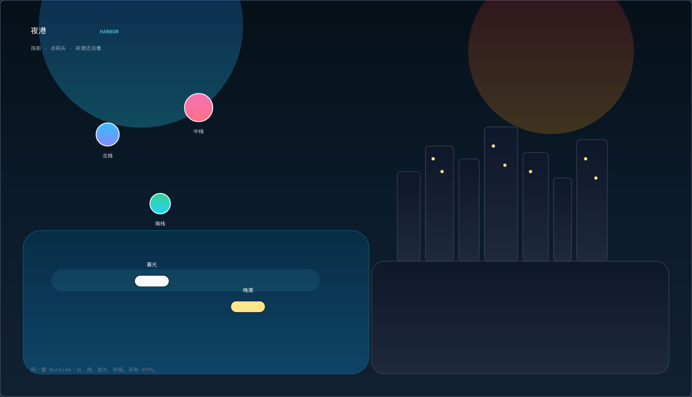
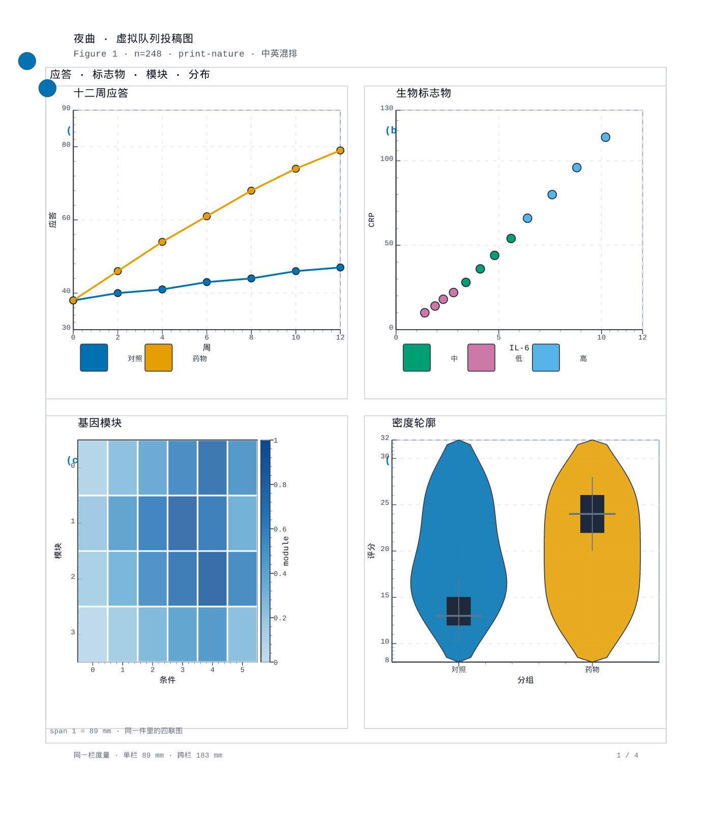
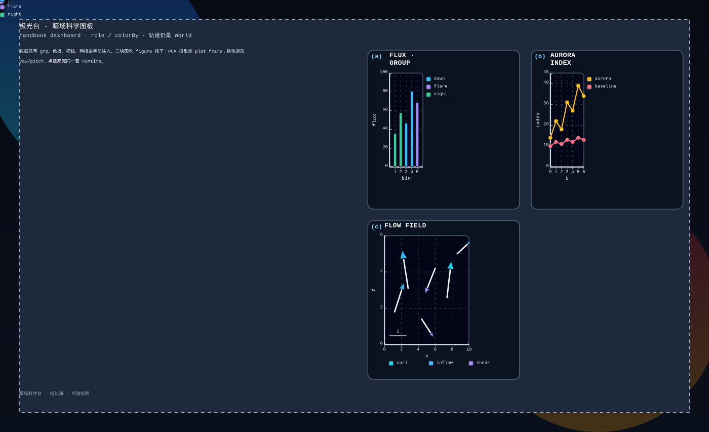
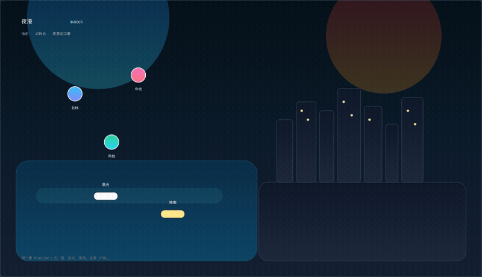
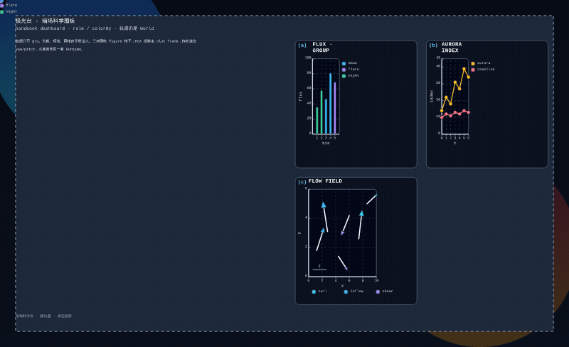
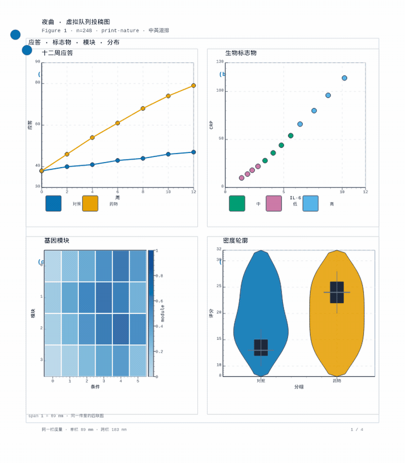

# Viva

[中文](./README.md)

Viva is a small language for figures. You write a `.viva` file. The compiler builds a clickable scene, or exports PNG, PDF, gif, and mp4.







Click a pier, drag a boat, turn the orbit:







Sources: [`examples/harbor.viva`](./examples/harbor.viva), [`examples/nocturne.viva`](./examples/nocturne.viva), [`examples/aurora.viva`](./examples/aurora.viva).

---

## Install

Install the compiler and the `viva` command. Node.js 18 or newer is required.

### npm package (Windows / macOS / Linux)

- Package: [packages/viva-lang-0.1.0.tgz](./packages/viva-lang-0.1.0.tgz)
- Checksum: [packages/SHA256SUMS](./packages/SHA256SUMS)

```bash
npm install -g ./packages/viva-lang-0.1.0.tgz
viva version
viva export examples/harbor.viva -f png --handbook dashboard -o harbor.png
```

Once it is on npm:

```bash
npm install -g viva-lang
```

### Install scripts

Linux / macOS:

```bash
bash install/one-click.sh
# if you already cloned the repo:
bash install/install.sh
export PATH="$HOME/.local/bin:$PATH"
viva version
```

Windows:

```powershell
powershell -ExecutionPolicy Bypass -File install\install.ps1
```

See [`install/README.md`](./install/README.md). To rebuild the release folder:

```bash
npm run pack:release
```

### From source

```bash
git clone https://github.com/yanshen2953/viva-lang.git
cd viva-lang
npm install
npm run build:lib
npm install -g .
viva version
```

Playground for editing the language and the examples:

```bash
npm run dev
```

Open http://localhost:5173

### Docker

For a server that already has Docker and needs the HTTP API:

```bash
docker compose up -d --build
curl http://localhost:8765/api/health
```

---

## A short program

```viva
artifact "Hello Viva"

state count = 0

scene
  size: 880 480
  background: #0b1220
  layer main
    node counter
      x: 440
      y: 240
      text: count
      font: 72
      fill: #f8fafc
      align: center

event click on counter
  count = count + 1
```

```bash
viva compile examples/hello.viva
viva export examples/nocturne.viva -f pdf --handbook print-nature -o nocturne.pdf
viva export examples/nocturne.viva --beats -f mp4 --handbook print-nature -o nocturne.mp4
viva serve --port 8765
viva mcp
```

| Command | Use |
| --- | --- |
| `viva` | compile, check, export |
| `viva mcp` | MCP for Cursor / Claude Desktop |
| `viva serve` | HTTP API |
| `import from "viva-lang"` | Node SDK |
| `import from "viva-lang/embed"` | embed a figure in a web page |

Language notes: [`docs/LANGUAGE.md`](./docs/LANGUAGE.md). Hosting: [`docs/DEPLOY.md`](./docs/DEPLOY.md).

---

## License

[GPL-3.0-or-later](./LICENSE). Commercial use is allowed. Keep the copyright notice. Modified versions must stay under the GPL.

Copyright (C) 2026 Viva Language Contributors
