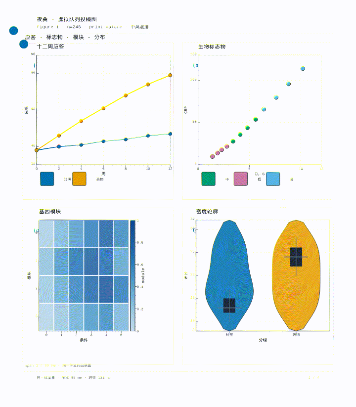
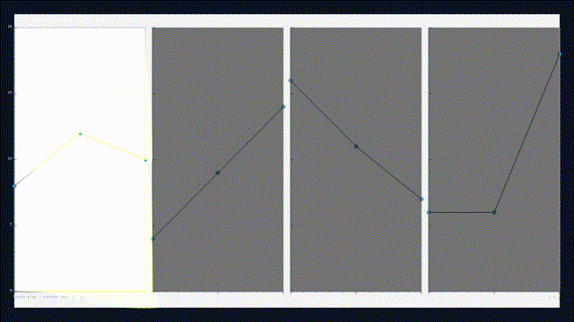

<p align="center">
  
</p>

<h1 align="center">Viva</h1>

<p align="center">
  <strong>模型只写意图，编译器长出可点击的世界。</strong><br />
  同一份极小 DSL：论文图、暗场仪表、夜港交互、分镜拍钟。
</p>

<p align="center">
  <a href="LICENSE"></a>
  <a href="https://github.com/yanshen2953/viva-lang"></a>
  
</p>

<p align="center">
  <a href="#画廊">画廊</a> ·
  <a href="#三十秒">三十秒</a> ·
  <a href="#同一份源码">源码</a> ·
  <a href="#许可">许可</a>
</p>

Viva 不是又一个前端框架。它是一门 **LLM-native** 的交互视觉语言：状态、事件、图表、栏宽、页刀都留给确定性编译器。Agent 写短意图，Runtime 负责点、拖、刷、翻拍。

仓库已经公开：<https://github.com/yanshen2953/viva-lang>

---

## 画廊

下面不是海报。每一段都是**同一份 `.viva` 源码**编出来的：静帧是 `viva export -f png`，视频是 Clock 拍钟或 Runtime 点/拖/tick 采帧后再交给 ffmpeg。

<table>
  <tr>
    <td align="center" width="50%">
      <a href="examples/harbor.viva"></a>
      <br />
      <strong>Harbor · 夜港</strong><br />
      <sub>点栈桥、拖船、灯呼吸 · 交互 mp4：<a href="docs/gallery/harbor.mp4">harbor.mp4</a></sub>
    </td>
    <td align="center" width="50%">
      <a href="examples/aurora.viva"></a>
      <br />
      <strong>Aurora · 极光台</strong><br />
      <sub>轨道自转、点选投影 · 交互 mp4：<a href="docs/gallery/aurora.mp4">aurora.mp4</a></sub>
    </td>
  </tr>
  <tr>
    <td align="center">
      <a href="examples/nocturne.viva"></a>
      <br />
      <strong>Nocturne · 夜曲</strong><br />
      <sub>print-nature 四联图 · Clock 拍钟 <a href="docs/gallery/nocturne.mp4">nocturne.mp4</a></sub>
    </td>
    <td align="center">
      <a href="examples/storyboard.viva"></a>
      <br />
      <strong>Reel · 分镜</strong><br />
      <sub>四拍 hold+ease，与 Runtime 同一套 Clock · <a href="docs/gallery/reel.mp4">reel.mp4</a></sub>
    </td>
  </tr>
</table>

<p align="center">
  <br />
  <sub>Nocturne 不只会播拍：页边针脚也能拖。源码在 <a href="examples/nocturne.viva">examples/nocturne.viva</a> · <a href="docs/gallery/nocturne-hand.mp4">nocturne-hand.mp4</a></sub>
</p>

Playground 打开即可点：`Harbor` / `Aurora` / `Nocturne`。

```bash
npm run gallery          # 重导出 docs/gallery 静帧 + gif/mp4
```

---

## 三十秒

```bash
npm install
npm run dev
```

浏览器打开 [http://localhost:5173](http://localhost:5173)。默认就是夜港：点栈桥、拖船。

```bash
npx viva export examples/harbor.viva -f png --handbook dashboard -o harbor.png
npx viva export examples/nocturne.viva --beats -f mp4 --handbook print-nature -o nocturne.mp4
```

CLI / Docker / Agent 接入见 [`docs/DEPLOY.md`](docs/DEPLOY.md)。  
圈选审查 → agent 修图：Playground「审查模式」或 [`docs/hosts/review.md`](docs/hosts/review.md)。

---

## 同一份源码

```viva
artifact "Harbor"

state selected = none

data piers = [
  { name: "北栈", x: 168, y: 210, r: 18, c1: "#38bdf8", c2: "#818cf8" }
]

scene
  size: 1080 620
  background: #061018

  layer fleet
    for pier in piers
      node pier as piers
        x: pier.x
        y: pier.y
        r: pier.r
        gradient: pier.c1 pier.c2
        glow: 20

event click on piers
  selected = pier
```

作者只写世界是什么、点了以后怎么变。渐变、光晕、栏宽、轴题、页戳、拍钟都是编译器的事。

完整语法：[`docs/LANGUAGE.md`](docs/LANGUAGE.md) · 设计：[`docs/DESIGN.md`](docs/DESIGN.md)

---

## 设计

- **小语言，大运行时**：不把图表种类和安全框加成关键字。
- **三柱同一套原语**：游戏式交互、论文图、分镜排版。
- **手册按需加载**：`print-nature` 投稿，`dashboard` 暗场。不选就是纯语法。
- **导出保真**：SVG / 矢量 PDF / PNG，以及与 Runtime 共用 Clock 的 gif/mp4。

```
src/          词法、IR、编译器、运行时、agent、导出
examples/     可运行展示件（Harbor / Aurora / Nocturne 是画廊）
playground/   本地演练场
docs/gallery/ 画廊静帧与交互视频
```

---

## 许可

**[GPL-3.0-or-later](LICENSE)**。

可商用、可修改、可再分发。必须保留署名（版权声明），衍生作品必须以 **同样的 GPL** 开源——这就是「署名 + 继承」。把 Viva 嵌进专有闭源产品而不公开相应源码，是不允许的。

Copyright (C) 2026 Viva Language Contributors
